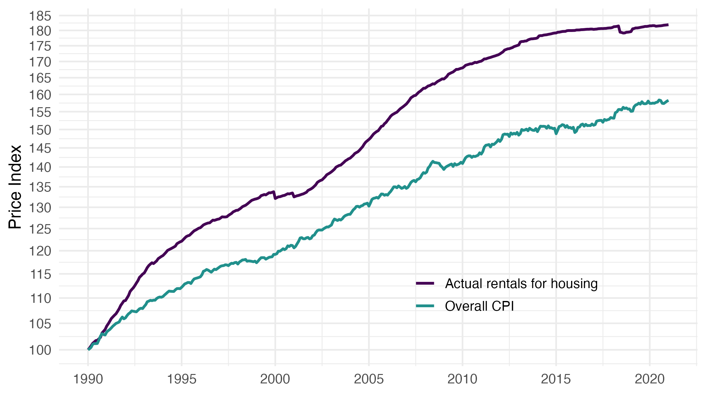
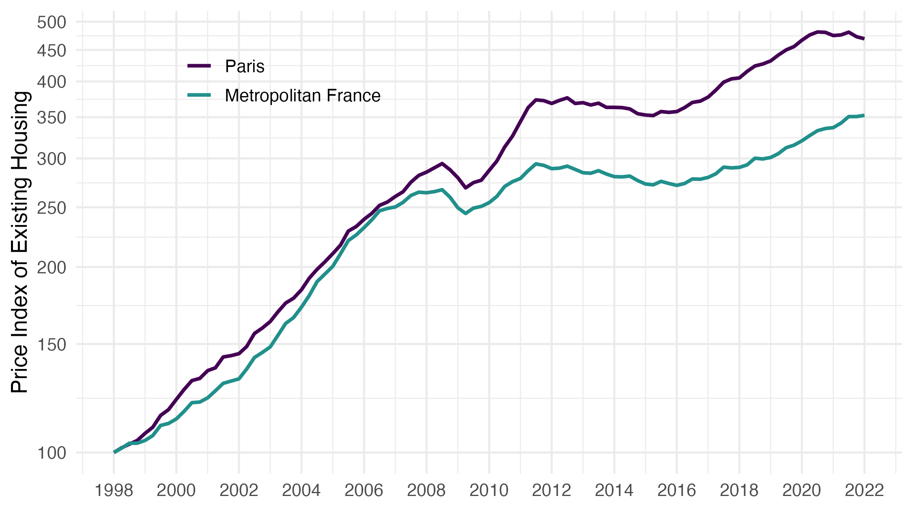

# Some remarks on Insee’s February 4, 2020 blog post ‘Yes, Insee does take housing into account in inflation!’

Publication date: February 22, 2022.

This repository provides replication codes for the related note [pdf](https://fgeerolf.com/blog-insee-CPI-rents.pdf), [html](https://fgeerolf.com/blog-insee-CPI-rents.html), [docx](https://fgeerolf.com/blog-insee-CPI-rents.docx).

## Replication Codes

### Figure 6: Overall CPI vs. Actual rent CPI

[Code R](figure6.R)

### Figure 7: Price index of existing dwellings, Metropolitan France and Paris

[Code R](figure7.R)

